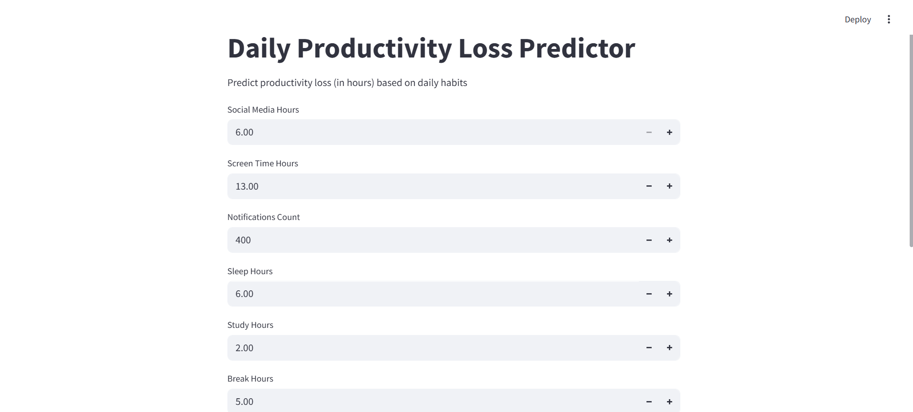
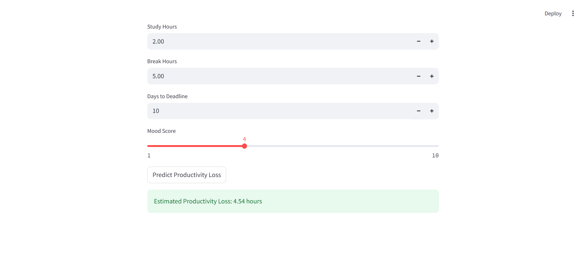

<h1 align="center">📊 Daily Productivity Loss Predictor</h1>

<p align="center">
A Machine Learning powered web application that predicts daily productivity loss (in hours) based on lifestyle and work habits.
</p>

<p align="center">
  
  
  
  
</p>

---

## 🚀 Project Overview

Daily Productivity Loss Predictor is an interactive Machine Learning web application built using **Python and Streamlit**.  

It estimates the number of productive hours lost in a day based on various behavioral and lifestyle factors such as:

- Social Media Usage
- Screen Time
- Notifications Count
- Sleep Hours
- Study Hours
- Break Hours
- Days to Deadline
- Mood Score

This tool helps users understand inefficiencies and improve time management.

---

## 🖥️ Application Preview

### 🔹 Input Interface



---

### 🔹 Prediction Output



---

## ⚙️ How It Works

1. User enters daily activity metrics.
2. The trained Machine Learning regression model processes the inputs.
3. The system predicts estimated productivity loss (in hours).
4. The result is displayed instantly on the dashboard.

---

## 🛠️ Tech Stack

- Python
- Streamlit
- Pandas
- NumPy
- Scikit-learn
- Joblib

---

## 📂 Project Structure

```
Daily-Productivity-loss/
│
├── app.py
├── ridge_productivity_model.pkl
├── requirements.txt
├── daily_productive_loss.ipynb
├── README.md
└── assets/
    ├── input_ui.png
    └── output_prediction.png
```
---

## 📜 License

This project is licensed under the MIT License.

You are free to use, modify, and distribute this project with proper attribution.

---

## 🤝 Contributing

Contributions are welcome!

If you'd like to improve this project:

1. Fork the repository
2. Create a new branch
3. Make your changes
4. Submit a Pull Request

Let’s build better productivity tools together 🚀
